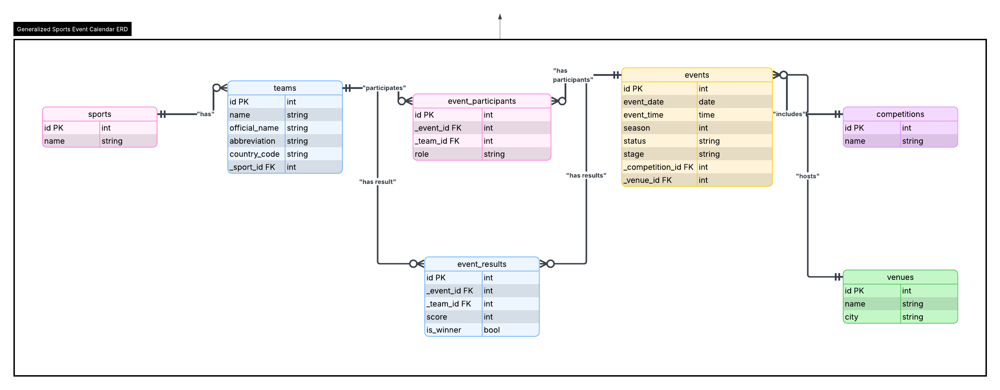

# Sports Events Calendar

A full-stack web application for managing and viewing sports events. Built as part of the Sportradar Coding Academy coding exercise.

Users can browse upcoming and past events, filter by sport/date/venue/team/competition, and add new events through a form interface.



For details on how AI was used during development, see [AI_Reflection.txt](docs/AI_Reflection.txt).

## Tech Stack

| Layer    | Technology                          |
|----------|-------------------------------------|
| Backend  | Java 25, Spring Boot 4, Spring Data JPA |
| Frontend | React 19, TypeScript, Vite          |
| Database | PostgreSQL 17                       |
| Testing  | JUnit 5, Mockito, H2 (in-memory)   |
| Infra    | Docker, Docker Compose, Nginx       |

## Features

**Core:**
- Full CRUD for events, sports, teams, venues, and competitions
- Event participants with home/away roles
- Event results with score and win/loss tracking
- Event status tracking (Scheduled, Ongoing, Completed, Canceled)

**Filtering:**
- Filter events by sport, date, venue, team, or competition
- Combine multiple filters simultaneously
- Clear all filters with one click

**Additional:**
- Database seeded with sample data (4 sports, 18 teams, 12 events, 8 venues, 7 competitions)
- Unified error response format with global exception handler
- Backend unit tests for controllers and services
- Dockerized setup — one command to run the full stack

## Database Design

The schema follows third normal form (3NF) with the following entities:

- **Sport** — sport types (Football, Basketball, Tennis, Ice Hockey)
- **Team** — teams linked to a sport
- **Venue** — event locations with city info
- **Competition** — leagues and tournaments
- **Event** — core entity with date, time, status, season, stage; references Competition and Venue
- **EventParticipant** — junction table linking events to teams (with home/away role)
- **EventResult** — scores and win/loss per team per event

Foreign keys follow the underscore prefix convention (e.g., `_sport_id`).

## Getting Started

### Prerequisites

- [Docker](https://docs.docker.com/get-docker/) and Docker Compose

### Run with Docker Compose

1. Clone the repository:
   ```bash
   git clone https://github.com/kielakjr/sports-events-calendar.git
   cd sports-events-calendar
   ```

2. Create a `.env` file in the project root:
   ```env
   POSTGRES_DB=sports_events
   POSTGRES_USER=postgres
   POSTGRES_PASSWORD=postgres
   DB_URL=jdbc:postgresql://db:5432/sports_events
   DB_USER=postgres
   DB_PASSWORD=postgres
   ```

3. Start the application:
   ```bash
   docker-compose up --build
   ```

4. Open the app:
   - **Frontend:** http://localhost:3000
   - **Backend API:** http://localhost:8080

The database is automatically seeded with sample data on first run.

### Local Development

**Backend:**
```bash
cd backend
./mvnw spring-boot:run
# Requires a running PostgreSQL instance and env vars set
```

**Frontend:**
```bash
cd frontend
npm install
npm run dev
# Runs on http://localhost:5173, proxies API calls to localhost:8080
```

## API Endpoints

| Method | Endpoint              | Description               |
|--------|-----------------------|---------------------------|
| GET    | `/api/events`         | List events (with filters)|
| GET    | `/api/events/{id}`    | Get single event          |
| POST   | `/api/events`         | Create event              |
| PUT    | `/api/events/{id}`    | Update event   |
| DELETE | `/api/events/{id}`    | Delete event              |
| GET    | `/api/sports`         | List sports               |
| POST   | `/api/sports`         | Create sport              |
| PUT    | `/api/sports/{id}`    | Update sport   |
| DELETE | `/api/sports/{id}`    | Delete sport              |
| GET    | `/api/teams`          | List teams                |
| POST   | `/api/teams`          | Create team               |
| PUT    | `/api/teams/{id}`     | Update team    |
| DELETE | `/api/teams/{id}`     | Delete team               |
| GET    | `/api/venues`         | List venues               |
| POST   | `/api/venues`         | Create venue              |
| PUT    | `/api/venues/{id}`    | Update venue   |
| DELETE | `/api/venues/{id}`    | Delete venue              |
| GET    | `/api/competitions`   | List competitions         |
| POST   | `/api/competitions`   | Create competition        |
| PUT    | `/api/competitions/{id}` | Update competition |
| DELETE | `/api/competitions/{id}` | Delete competition     |

**Event filter query parameters:** `sport`, `date`, `venueId`, `teamId`, `competitionId`

## Running Tests

```bash
cd backend
./mvnw test
```

Tests use an H2 in-memory database for isolation from the production PostgreSQL instance.

## Assumptions and Decisions

- **Spring Boot + React** was chosen for a clean separation between API and UI, making both independently testable and deployable.
- **PostgreSQL** was selected as the relational database for its maturity and strong support for complex queries.
- **Docker Compose** orchestrates all three services (DB, backend, frontend) with health checks to ensure proper startup order.
- **Hibernate `ddl-auto=update`** manages schema creation and migration automatically — suitable for this exercise scope.
- **Nginx** serves the production frontend build and proxies API requests to the backend container.
- **Event filtering** is handled via a single query with optional parameters to avoid executing SQL queries inside loops.
- **Data seeding** runs only when the database is empty, preventing duplicate entries on restarts.
- **Foreign key naming** uses the underscore prefix convention (`_sport_id`) as specified in the exercise requirements.
- **Referential integrity** is enforced — sports, teams, venues, and competitions cannot be deleted if they are referenced by existing events. The API returns a clear error message in this case.
